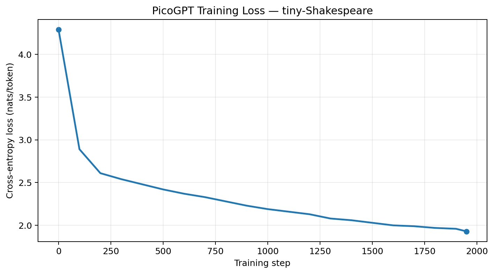

# PicoGPT

A GPT, built upward from a single neuron — no transformers library, no borrowed layers, no black boxes.

**Pico** for the scale this runs at: an ~800K-parameter, character-level model built module by module rather than imported, small enough to train on a laptop CPU while every piece — attention, GQA, KV-cache, RMSNorm, and the training loop itself — is something you derived and can verify by hand.

## Overview

This repository traces the full arc of a decoder-only transformer, one primitive at a time:

**neuron → backprop → MLP → tokenizer → embeddings → attention → transformer block → GPT → training loop → generation → modern scaling tricks (RMSNorm, GQA, KV-caching)**

Each stage is its own tested, self-contained module rather than a single monolithic script. That structure was a deliberate choice: it forces every layer's forward and backward behavior to be understood well enough to reproduce exactly. Modules are seeded for deterministic, checkable output, making this a different exercise from simply calling `nn.MultiheadAttention` and moving on.

## Highlights

- **Manual backprop** — hand-derived gradients for a single neuron and a 2-layer MLP (`foundations/backprop.py`, `foundations/multi_layer_backprop.py`) before relying on autograd.
- **Byte-Pair Encoding from scratch** — a first-principles BPE merge algorithm (`data/tokenizer.py`), alongside a character-level vocabulary/encode/decode pipeline (`data/vocab.py`).
- **Attention, three ways** — single-head causal attention → multi-head attention → Grouped Query Attention (GQA), the mechanism used in modern LLMs such as LLaMA and Mistral.
- **KV-caching** — incremental key/value caching for autoregressive decoding, avoiding recomputation of previous K/V projections.
- **Three normalization schemes** — LayerNorm, BatchNorm (including running-stat train/inference modes), and RMSNorm.
- **A full Pre-LN GPT** — sinusoidal positional encoding, residual transformer blocks, AdamW training, and multinomial autoregressive sampling, assembled into a working character-level language model.

## Project structure

```text
.
├── foundations/         # ML primitives, built before transformer code
│   ├── neuron.py, activations.py, loss.py, softmax.py
│   ├── gradient_descent.py, linear_regression.py, linear_regression_training.py
│   ├── backprop.py, multi_layer_backprop.py, mlp.py, weight_init.py
│   ├── digit_classifier.py, sentiment.py, pytorch_basics.py
│   └── dead_relu_detector.py, training_diagnostics.py
│
├── data/                # Tokenization and batching
│   ├── vocab.py             # char-level stoi/itos, encode/decode
│   ├── tokenizer.py         # BPE merge learning from raw corpus
│   ├── tokenizer_utils.py   # greedy tokenization + fertility-score analysis
│   ├── dataset.py, loader.py
│   └── nlp_preprocessing.py
│
├── model/               # Transformer components
│   ├── embeddings.py, positional_encoding.py
│   ├── attention.py             # single-head causal self-attention
│   ├── multi_head_attention.py  # multi-head self-attention
│   ├── grouped_query_attention.py # GQA
│   ├── kv_cache.py              # incremental K/V cache
│   ├── normalization.py, batch_normalization.py, rms_normalization.py
│   ├── transformer.py            # Pre-LN transformer block
│   └── gpt.py                    # full GPT model
│
├── train.py             # AdamW + cross-entropy training loop
├── generate.py          # autoregressive sampling
└── requirements.txt
```

## Training: tiny-Shakespeare

The model was trained character-by-character on **tiny-Shakespeare** (about 1.11M characters, vocabulary size 65).

Configuration:

| Setting | Value |
|---|---:|
| Parameters | ~816K |
| Blocks | 4 |
| Attention heads | 4 |
| Model dimension | 128 |
| Context length | 64 |
| Batch size | 16 |
| Optimizer | AdamW |
| Learning rate | 3e-4 |
| Device | CPU |
| Training steps | 1,950 |
| Initial loss | 4.29 nats/token |
| Final loss | 1.93 nats/token |
| Training time | ~170 seconds |

### Training loss



The loss fell by roughly **55%** from initialization, from **4.29** to **1.93 nats/token** over 1,950 steps. The initial loss is close to the random-guess baseline `ln(65) ≈ 4.17`. At ~2K CPU steps, the model has learned substantial character and whitespace statistics, while coherent long-form generation is still limited — expected for a model this small and training run this short.

## Quickstart

The modules are composable units rather than a CLI, so a full train → generate loop looks like:

```python
import torch
from model.gpt import GPT
from data.vocab import Solution as Vocab
from train import Solution as Trainer
from generate import Solution as Generator

# 1. Build a character-level vocabulary from any text file
text = open("corpus.txt").read()
stoi, itos = Vocab().build_vocab(text)
data = torch.tensor(Vocab().encode(text, stoi))

# 2. Instantiate the model
model = GPT(
    vocab_size=len(stoi),
    context_length=64,
    model_dim=128,
    num_blocks=4,
    num_heads=4,
)

# 3. Train
final_loss = Trainer().train(
    model, data, epochs=500, context_length=64, batch_size=16, lr=3e-4
)
print(f"final loss: {final_loss}")

# 4. Generate
context = torch.zeros((1, 1), dtype=torch.long)
sample = Generator().generate(
    model, new_chars=200, context=context, context_length=64, int_to_char=itos
)
print(sample)
```

## Important implementation note

`GPT.forward()` originally ends with `torch.round(x, decimals=4)`, which is useful for the fixed-precision numerical tests this project was built around, but it destroys gradients through the rounded tensor. Calling the committed training path without bypassing that rounding will therefore not produce a meaningful optimization run.

For training, the final rounding must be skipped; it can remain enabled for deterministic inference/test outputs. A planned cleanup is to expose this explicitly as `round_output=False` during training.

## Design philosophy

Every `__init__` and `forward` is deliberately explicit about its computation. The foundational modules use pure NumPy or minimal PyTorch where possible, while the transformer components use `torch.nn.Module` without outsourcing the architecture to a transformers library.

The goal is not to reproduce a production-scale LLM. The goal is to make the entire stack small enough that the mechanics of a GPT can be inspected, derived, tested, and understood end-to-end.

## Roadmap

- [ ] Add a `round_output=False` path to `GPT.forward()` so training does not require an external workaround.
- [ ] Wire GQA + KV-cache into `gpt.py` as an inference-time fast path.
- [ ] Add a small CLI (`python -m picogpt.train --corpus ...`).
- [ ] Replace sinusoidal positional encoding with RoPE.
- [ ] Add unit tests independent of the fixed-seed grading harness.

## License

MIT License

Copyright (c) 2026 Pranav Bansal

Permission is hereby granted, free of charge, to any person obtaining a copy
of this software and associated documentation files (the "Software"), to deal
in the Software without restriction, including without limitation the rights
to use, copy, modify, merge, publish, distribute, sublicense, and/or sell
copies of the Software, and to permit persons to whom the Software is
furnished to do so, subject to the following conditions:

The above copyright notice and this permission notice shall be included in all
copies or substantial portions of the Software.

THE SOFTWARE IS PROVIDED "AS IS", WITHOUT WARRANTY OF ANY KIND, EXPRESS OR
IMPLIED, INCLUDING BUT NOT LIMITED TO THE WARRANTIES OF MERCHANTABILITY,
FITNESS FOR A PARTICULAR PURPOSE AND NONINFRINGEMENT. IN NO EVENT SHALL THE
AUTHORS OR COPYRIGHT HOLDERS BE LIABLE FOR ANY CLAIM, DAMAGES OR OTHER
LIABILITY, WHETHER IN AN ACTION OF CONTRACT, TORT OR OTHERWISE, ARISING FROM,
OUT OF OR IN CONNECTION WITH THE SOFTWARE OR THE USE OR OTHER DEALINGS IN THE
SOFTWARE.
